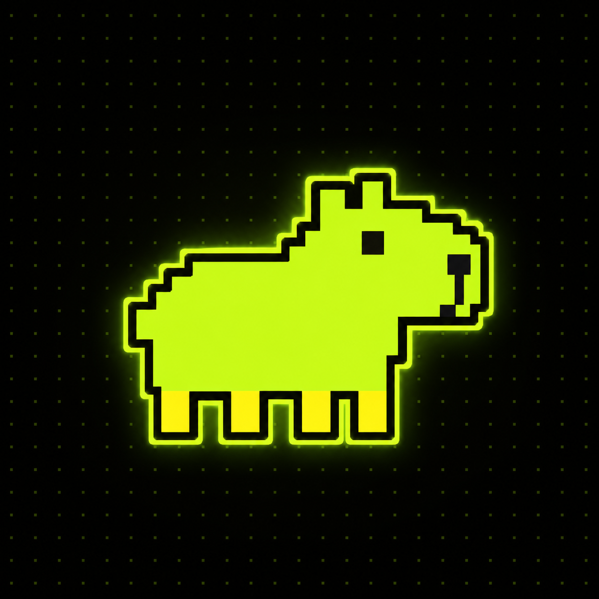
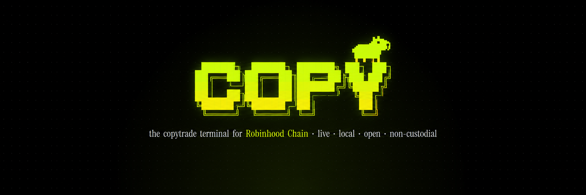
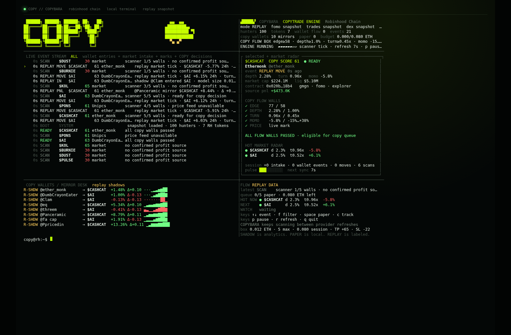
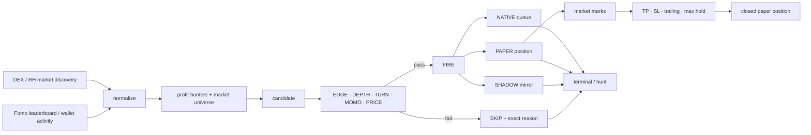

<p align="center">
  
</p>

<p align="center">
  
</p>

<h1 align="center">COPY</h1>

<p align="center">
  <strong>Working CLI-first copytrade terminal for Robinhood Chain.</strong><br/>
  Profit hunters → fresh RH markets → COPY decision → wallet mirrors → paper positions → native queue.
</p>

<p align="center">
  
  
  
  
</p>

<p align="center">
  <a href="#install">Install</a> ·
  <a href="#terminal">Terminal</a> ·
  <a href="#copy-wallets">COPY Wallets</a> ·
  <a href="#copy-flow-walls">Flow Walls</a> ·
  <a href="#commands">Commands</a>
</p>

---

## About

**COPY is a working local-first copytrade terminal built around Robinhood Chain market flow.**

It continuously grows a Robinhood token universe, follows profitable-wallet context, evaluates every setup through COPY-native flow walls, explains every `FIRE / SKIP`, rotates COPY wallet mirrors, marks paper positions, and keeps the native execution queue visible from the same terminal.

The CLI is the main product. The browser layer is only an optional wrapper around the same data and queue stack.

### Current build

| Engine | Status | What is already in the repo |
| --- | --- | --- |
| Token discovery | **WORKING** | growing RH market universe + newest-first event stream |
| Profit hunters | **WORKING** | ranked Fomo context + tracked source inspection |
| COPY decision | **WORKING** | `EDGE / DEPTH / TURN / MOMO / PRICE` + refusal reason |
| COPY WALLETS | **WORKING** | rotating trader/token mirrors + fast PnL deltas + sparklines |
| Paper engine | **WORKING** | open, mark, TP, SL, trailing, clock exits |
| Native queue | **WORKING** | server-side execution boundary without browser wallet connect |
| Terminal UI | **WORKING** | full-screen TUI, keyboard controls, hot radar, source pulse, positions, exits |

<p align="center">
  
</p>

> `npm start` opens the terminal. `npm run hunt` runs the raw scrolling feed. `npm run paper` runs the local paper engine.

---

## What COPY does

| Problem | What COPY does | Command |
| --- | --- | --- |
| profitable wallets are scattered | keeps a ranked hunter set and a live terminal view | `copy terminal` · `copy trader` |
| new RH tokens keep showing up | grows the market universe during the session instead of freezing at a short list | `copy terminal` · `copy hunt` |
| “wallet bought” is not enough | runs COPY flow walls and prints the exact reason for `FIRE` or `SKIP` | `copy terminal` · `copy rules` |
| a static board dies on stream | keeps scanners, market marks, wallet mirrors and paper positions moving | `copy terminal` |
| you want to test the setup safely | opens and marks local paper positions with the same rules and exits | `copy paper` |
| you want execution later | includes a native queue boundary for a server-side executor | `copy web` |

---

## Install

Node 20 or newer.

```bash
git clone https://github.com/YOUR_HANDLE/copy.git
cd copy
npm install
cp .env.example .env
npm run doctor
```

Or install it as a local command:

```bash
npm install -g .
copy doctor --probe
```

## Sixty seconds

```bash
npm run doctor      # provider + Robinhood Chain health
npm start           # full-screen interactive terminal
npm run hunt        # raw scrolling decision feed
npm run paper       # local paper-copy loop
npm run showcase    # high-cadence terminal mode for demos / recording
npm run web         # optional browser wrapper + native queue UI
```

With the binary installed:

```bash
copy terminal
copy hunt --fire-only
copy trader ether_monk
copy scan CASHCAT
copy positions
copy rules
copy doctor --probe
```

---

## Terminal

```bash
copy terminal
```

The full-screen terminal keeps three things on screen at the same time:

1. the newest token / wallet / decision events,
2. the selected decision breakdown on the right,
3. the COPY wallet desk underneath.

Main event types:

| Event | Meaning |
| --- | --- |
| `NEW` | a fresh Robinhood market entered the universe |
| `BUY` / `SELL` | a tracked wallet / profit-hunter event was observed |
| `MOVE` | a live market mark changed |
| `SCAN` | COPYBARA re-ran the flow walls |
| `READY` | a candidate currently passes the decision box |
| `COPY` | a paper copy was opened |
| `PNL` | an open paper position received a new mark |
| `EXIT` | TP, SL, trailing, max-hold or manual close |
| `SYNC` | provider refresh completed |

Keys:

```text
↑ / ↓    move through events
f        ALL → FIRE → SKIP
space    open selected FIRE as a PAPER copy
c        track / untrack selected source
p        pause / resume scanner
r        refresh providers now
q        quit
```

The top line carries the COPY wordmark with the running pixel COPYBARA. The right pane explains the selected token: source, score, walls, reason, market box, radar, native queue state, and recent desk activity.

More: [`docs/TERMINAL.md`](docs/TERMINAL.md).

## Hunt

```bash
copy hunt
copy hunt --fire-only
copy hunt --for 300
copy hunt --json
```

`hunt` runs the same engine without the full-screen renderer. It is useful for a raw terminal wall, logging, piping JSON, or showing a Bodkin-style scrolling feed.

## Paper

```bash
copy paper
copy paper --for 300
```

Paper mode watches fresh candidates, opens passing setups while slots and budget remain, re-marks positions, and closes them on the configured exits.

```text
FIRE → PAPER OPEN → MARK → TP / SL / TRAIL / CLOCK → CLOSED
```

`copy positions` prints the current open and recently closed paper positions.

---

## COPY WALLETS

The lower desk keeps the profitable-wallet side of the product alive.

Each row shows the trader, current token pair, current PnL, delta since the last tick, and a tiny sparkline. The desk keeps rotating and re-marking so the screen stays active while the upper feed keeps discovering tokens.

```text
SHADOW @ether_monk      → $CASHCAT   +4.18%  Δ+0.22  ▁▂▃▄▆█
SHADOW @threem          → $AI        -0.41%  Δ-0.13  ▆▅▄▃▂▁
PAPER  @DumbCrayonEater → $CASHCAT   +0.73%  Δ+0.09  ▁▁▂▄▅█
```

COPY WALLETS in the current build:

- rotates through a larger trader pool instead of a static list,
- changes token pairs continuously,
- updates PnL and delta frequently,
- keeps adding fresh markets into the desk as the session grows,
- mirrors the same symbols you see higher in the main event flow.

## COPY flow walls

COPY score is context, not the permission switch. The default decision box is intentionally copytrade-native:

| Wall | Default | What it asks |
| --- | ---: | --- |
| `EDGE` | COPY DNA ≥ 58 | is the source strong enough? |
| `DEPTH` | liquidity / market cap ≥ 1.00% | is there enough depth relative to size? |
| `TURN` | 24h volume / liquidity ≥ 0.45× | is the market actually turning over? |
| `MOMO` | −15% … +38% | is the move inside the configured copy band? |
| `PRICE` | required | is there a fresh mark to trade against? |

A token is either accepted or refused by the first wall that fails.

```text
profit source
    ↓
wallet activity / market discovery
    ↓
EDGE → DEPTH → TURN → MOMO → PRICE
    ↓
FIRE / SKIP + reason
    ↓
SHADOW mirror / PAPER copy / native queue
    ↓
marks → PnL delta → exit rule
```

More: [`docs/STRATEGY.md`](docs/STRATEGY.md).

## Paper box

| Limit | Default |
| --- | ---: |
| size per copy | `0.012 ETH` |
| maximum open positions | `5` |
| session budget | `0.080 ETH` |
| take profit | `+65%` |
| stop loss | `−22%` |
| trailing distance | `18%` from peak |
| max hold | `32 min` |

These are the defaults the paper engine starts with. You can inspect them with `copy rules` and keep tuning the box from there.

---

## Runtime modes

| Mode | What it does |
| --- | --- |
| `LIVE` | streams fresh market and wallet context from configured sources |
| `SNAPSHOT` | boots instantly from last-known-good state and keeps the terminal usable |
| `SHOWCASE` | keeps the stream extra active for demos, recordings, and screenshares |

The terminal starts fast, keeps the event stream moving, and does not collapse when a source responds with a smaller batch than usual.

## Live inputs

Public mode can run with no secret:

- Fomo public leaderboard mirror,
- DEX market discovery / price / liquidity / volume,
- Robinhood Chain RPC health,
- last-known-good bootstrap.

Optional read credentials add richer wallet-level activity:

```bash
REPLYNODES_API_KEY=
# or
FOMO_BEARER_TOKEN=
```

There is no browser wallet connect in the product UX. The optional web wrapper exposes a native queue interface instead.

## Commands

| Command | What it does |
| --- | --- |
| `copy terminal [--demo]` | interactive two-pane terminal |
| `copy hunt [--fire-only] [--for n] [--json]` | endless scrolling event / decision feed |
| `copy paper [--for n]` | local paper-copy loop and exits |
| `copy trader <handle>` | one profit hunter profile |
| `copy scan <symbol\|address>` | one known Robinhood market |
| `copy positions` | open + recently closed paper positions |
| `copy rules` | current decision / exposure rules |
| `copy doctor --probe` | providers, chain ID and bootstrap health |
| `copy web` | optional browser wrapper / native queue server |

Every command and environment variable: [`docs/COMMANDS.md`](docs/COMMANDS.md).

---

## How it works



The runtime is one Node process. `data/seed.json` provides the bootstrap set, `data/runtime.json` stores local rules and positions, and the in-memory universe keeps growing as new tokens are found.

More: [`docs/ARCHITECTURE.md`](docs/ARCHITECTURE.md).

## Project map

```text
bin/copy.mjs                CLI entrypoint
src/cli/runtime.mjs         provider merge + endless event stream + marks
src/cli/render.mjs          full-screen terminal renderer
src/cli/terminal.mjs        keyboard input + timers
src/cli/rules.mjs           COPY flow walls + paper exposure checks
src/providers/              Fomo / DEX / Robinhood readers
src/services/               shared state + native queue services
public/                     optional browser wrapper
data/seed.json              bootstrap state
data/runtime.json           local CLI state (created at runtime)
contracts/CopyRegistry.sol  optional rules registry
assets/copy-banner.png      GitHub README banner
assets/copybara-avatar.png  GitHub avatar / profile image
assets/terminal.png         terminal capture
```

## Tests

```bash
npm test
```

The test suite checks the bootstrap, COPY-native decision flow, growing market universe, rotating wallet pairs, moving mirror PnL, event stream, web queue plumbing, and terminal project files.

## FAQ

**Does COPY already work?**  
Yes. `terminal`, `hunt`, `paper`, `doctor`, `rules`, `positions`, and the optional `web` wrapper all run in the current repository.

**Why can a high-score token still be refused?**  
Because the score is context. Permission still depends on `EDGE`, `DEPTH`, `TURN`, `MOMO`, `PRICE`, exposure, and budget.

**Can I keep it open on a stream or call?**  
Yes. The terminal is built to keep moving, adding tokens, updating markets, rotating COPY wallets, and keeping the right pane useful over time.

**Can I wire execution later?**  
Yes. The native queue boundary is already in the project. See [`docs/SAFETY.md`](docs/SAFETY.md) and [`docs/ARCHITECTURE.md`](docs/ARCHITECTURE.md).

## Built on

| Source | Used for |
| --- | --- |
| [Fomo](https://fomo.family/) / [fomp](https://www.fomp.app/) | profitable-wallet discovery and optional wallet activity |
| [Robinhood Chain](https://docs.robinhood.com/chain/) | chain ID `4663` and network RPC health |
| [GMGN](https://gmgn.ai/?chain=robinhood) | token deep links from the product UI |
| DEX market data | token price, market cap, liquidity and 24h volume enrichment |

## Safety

Read [`docs/SAFETY.md`](docs/SAFETY.md) before wiring an external executor. Keep signing material outside the browser and outside the repository.

## License

MIT. See [`LICENSE`](LICENSE).
