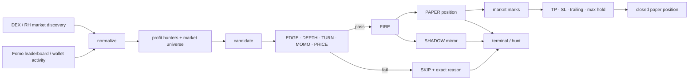

# COPY

> **The smart-wallet terminal for Robinhood Chain. Fomo finds the trader. COPY follows the flow, rejects weak setups, and keeps the mirror moving.**


COPY is a CLI-first copytrade research terminal for Robinhood Chain. It combines profitable-wallet discovery, Robinhood token markets, a rule-based copy decision, paper positions, live marks, and an always-moving terminal UI. The browser page is optional; the terminal is the product.

COPY does not blindly mirror every buy. A wallet can be green and the token can still be refused. Every decision prints the wall that failed.

| The problem | What COPY does | Command |
| --- | --- | --- |
| profitable wallets are scattered across a leaderboard | keeps a ranked hunter set and lets you inspect one source | `trader` · `terminal` |
| new Robinhood markets keep appearing | merges new markets into a growing session universe instead of replacing the list | `terminal` · `hunt` |
| “wallet bought” is not enough reason to copy | runs five COPY-native flow walls and prints `FIRE` or the first refusal | `terminal` · `rules` |
| a dashboard dies when the feed gets quiet | scanner pulses, market marks and wallet mirrors keep the terminal alive without inventing live trades | `terminal` |
| you need something safe to watch before execution | paper positions use the same rules, marks and exits without broadcasting a transaction | `paper` · `positions` |
| demos should move even without external APIs | `REPLAY` mode creates an explicitly labeled, endless demo stream | `terminal --demo` |

---

## Install

Node 20 or newer. Everything in the CLI runs locally.

```bash
# 1. clone the repository
git clone https://github.com/LunarResearcher/copy.git
cd copy
npm install
cp .env.example .env
npm run doctor
```

Or install the checkout as a local command:

```bash
npm install -g .
copy doctor --probe
```

No runtime npm packages are required by the current build. Public mode can start without an API key; optional read credentials add richer wallet-level activity.

On Windows the repository also carries `start-terminal.cmd`, `start-hunt.cmd`, and `start-paper.cmd`. On macOS / Linux use the commands below directly.

## Sixty seconds

```bash
npm run doctor      # provider + Robinhood Chain health
npm start           # full-screen interactive COPY terminal
npm run hunt        # raw scrolling decision/event feed
npm run paper       # automatic local paper-copy loop
npm run showcase    # endless REPLAY mode for demos / recording
npm run web         # optional browser wrapper
```

With the binary installed:

```bash
copy terminal
copy hunt --fire-only
copy trader ether_monk
copy scan CASHCAT
copy positions
copy rules
copy doctor --probe
```

---

## terminal

```bash
copy terminal
```

The full-screen terminal has three jobs at once: keep the newest events visible, explain the selected decision, and show what the mirrored wallet desk is doing underneath.

The stream is newest-first. COPY can write:

| Event | Meaning |
| --- | --- |
| `NEW` | a new Robinhood market was discovered by a live source |
| `BUY` / `SELL` | wallet activity returned by a configured Fomo read source |
| `MOVE` | a live market price / volume mark changed on refresh |
| `SCAN` | COPYBARA re-evaluated a token against the flow walls |
| `READY` | a bootstrapped candidate currently passes the decision box |
| `COPY` | a local paper copy was opened |
| `PNL` | an open paper position received a new mark |
| `EXIT` | TP, SL, trailing, max-hold or manual paper exit |
| `SYNC` | provider refresh completed |
| `REPLAY …` | showcase-only event; never presented as live activity |

Keys:

```text
↑ / ↓    move through events
f        ALL → FIRE → SKIP
space    open selected FIRE as a PAPER copy
c        track / untrack selected source
p        pause / resume scanner
r        refresh providers now
q        quit
```

The pixel COPYBARA runs beside the wordmark while the terminal is active. The right pane explains the currently selected event: source, market, COPY score, all five walls, the first refusal, provider state and the hot-market radar.

More: [`docs/TERMINAL.md`](docs/TERMINAL.md).

## hunt

```bash
copy hunt
copy hunt --fire-only
copy hunt --for 300
copy hunt --json
```

`hunt` is the same event engine without the full-screen renderer. It is useful for a raw wall-of-text terminal, recording output, or piping JSON into another process.

Unlike a one-shot scanner, it keeps running. Scanner pulses appear between provider refreshes; live markets and wallet events are merged when they arrive.

## paper

```bash
copy paper
copy paper --for 300
```

Paper mode loops over fresh candidates, opens only `FIRE` decisions while slots and budget remain, re-marks positions, and closes on the configured exit rules. Nothing is signed or broadcast by this CLI command.

```text
FIRE → PAPER OPEN → MARK → TP / SL / TRAIL / CLOCK → CLOSED
```

`copy positions` prints open positions and recent closes from the local runtime store.

---

## COPY WALLETS

The lower desk answers a different question from the token feed: **what would the profitable-wallet side of the screen look like right now?**

Two labels matter:

- `SHADOW` — an analytical mirror of a passing wallet/token pair. It is not an executed trade.
- `PAPER` — a local paper position opened by the paper engine or with `space`.

Each row carries the trader, current pair, PnL, delta since the previous mark, and a small session sparkline.

```text
SHADOW @ether_monk      → $CASHCAT   +4.18%  Δ+0.22  ▁▂▃▄▆█
SHADOW @threem          → $AI        -0.41%  Δ-0.13  ▆▅▄▃▂▁
PAPER  @DumbCrayonEater → $CASHCAT   +0.73%  Δ+0.09  ▁▁▂▄▅█
```

In live mode those pairs grow from the actual hunter/token data COPY has read. In showcase mode a larger rotating mirror desk is deliberately simulated and labeled `R-SHDW` / `REPLAY` so it can never be confused with an on-chain fill.

## The five flow walls

COPY score is context. It is **not** the permission switch. The default paper decision uses a copytrade-oriented flow box:

| Wall | Default | What it asks |
| --- | ---: | --- |
| `EDGE` | COPY DNA ≥ 58 | is there a strong enough profit source behind the candidate? |
| `DEPTH` | liquidity / market cap ≥ 1.00% | is there enough market depth relative to size? |
| `TURN` | 24h volume / liquidity ≥ 0.45× | is the market actually turning over? |
| `MOMO` | −15% … +38% | is the 24h move inside the configured copy band? |
| `PRICE` | required | can the paper engine mark an entry at all? |

A single failed wall is enough to refuse the candidate, and the terminal prints why.

```text
profit source
    ↓
wallet activity / market discovery
    ↓
EDGE → DEPTH → TURN → MOMO → PRICE
    ↓
FIRE / SKIP + reason
    ↓
SHADOW mirror / PAPER copy
    ↓
marks → PnL delta → exit rule
```

The defaults are a demo / paper starting point, not a claim that the settings are profitable. The full rule logic is in [`docs/STRATEGY.md`](docs/STRATEGY.md).

## Paper box

| Limit | Default |
| --- | ---: |
| size per copy | `0.012 ETH` |
| maximum open positions | `5` |
| session budget | `0.080 ETH` |
| take profit | `+65%` |
| stop loss | `−22%` |
| trailing distance | `18%` from peak |
| max hold | `32 min` |

The exposure and budget checks are part of the same decision function as the market walls. Once a slot or session limit is reached, another otherwise-good token is refused.

---

## Live, snapshot and replay are different things

COPY keeps those states visible on purpose.

| Label | What it means |
| --- | --- |
| `LIVE` | at least one external source is currently returning fresh data |
| `SNAPSHOT` | the terminal is running from its last-known-good bootstrap while live reads are unavailable |
| `REPLAY` | explicit showcase mode with synthetic demo markets / marks |

Data honesty rules:

- live `BUY` / `SELL` lines come only from configured wallet-activity reads;
- live `MOVE` comes from changed market data;
- `SCAN` is a local decision event, not somebody buying a token;
- `SHADOW` is analytics, not custody;
- `PAPER` is local bookkeeping;
- replay markets, wallet entries and PnL are always labeled replay;
- the CLI in this repository does not call an on-chain buy or sell function.

That separation is why a quiet provider can make the screen slower without forcing COPY to manufacture a fake “live trade”.

## Showcase

```bash
npm run showcase
# same as
copy terminal --demo
```

Showcase exists for README captures, videos and calls. It starts from the real bootstrap set, adds explicitly replay-only markets over time, rotates replay wallet/token pairs, re-marks their PnL, and keeps a deep rolling event history.

Current showcase cadence is intentionally busy:

| Motion | Approximate cadence |
| --- | ---: |
| market / mirror tick | `~0.9 s` |
| new replay market | `~1.8 s` |
| wallet pair rotation | `~2.7 s` |
| new replay mirror | `~6.3 s` |
| provider refresh loop | `~12 s` |
| event history kept in memory | up to `20,000` rows |

The monotonic event counter continues even when old rows are compacted, so the session can keep running without an artificial “35 token” ceiling.

---

## Live inputs

Public mode can run with no secret:

- Fomo public leaderboard mirror;
- DEX market discovery / price / liquidity / volume;
- Robinhood Chain RPC health;
- last-known-good bootstrap when a source degrades.

Optional read credentials add wallet-level Fomo activity and more discovery:

```bash
REPLYNODES_API_KEY=
# or
FOMO_BEARER_TOKEN=
```

The terminal never asks the browser to connect a wallet.

The optional web wrapper has a separate native execution queue interface. If you later connect your own server-side executor / relayer, the webhook contract is documented in [`docs/SAFETY.md`](docs/SAFETY.md) and [`docs/ARCHITECTURE.md`](docs/ARCHITECTURE.md). The CLI itself remains paper-only in this repository.

## Commands

| Command | What it does | Needs a signing key |
| --- | --- | --- |
| `copy terminal [--demo]` | interactive two-pane terminal | no |
| `copy hunt [--fire-only] [--for n] [--json]` | endless scrolling event / decision feed | no |
| `copy paper [--for n]` | local paper-copy loop and exits | no |
| `copy trader <handle>` | one Fomo profit hunter | no |
| `copy scan <symbol\|address>` | one known Robinhood market | no |
| `copy positions` | open + recently closed paper positions | no |
| `copy rules` | current decision / exposure rules | no |
| `copy doctor --probe` | providers, chain ID and bootstrap health | no |
| `copy web` | optional browser wrapper / native queue server | no browser key |

Every command and environment variable: [`docs/COMMANDS.md`](docs/COMMANDS.md).

---

## How it works



The runtime is one Node process. `data/seed.json` provides last-known-good boot data; `data/runtime.json` stores local rules, tracking choices and paper positions. Live sources merge into the in-memory universe instead of replacing it with a smaller response.

More: [`docs/ARCHITECTURE.md`](docs/ARCHITECTURE.md).

## Project map

```text
bin/copy.mjs                CLI entrypoint
src/cli/runtime.mjs         provider merge + endless event stream + marks
src/cli/render.mjs          full-screen terminal renderer
src/cli/terminal.mjs        keyboard input + timers
src/cli/rules.mjs           COPY flow walls + paper exposure checks
src/providers/              Fomo / DEX / Robinhood readers
src/services/               shared state + native queue services
public/                     optional browser wrapper
data/seed.json              last-known-good bootstrap
data/runtime.json           local CLI state (created at runtime)
contracts/CopyRegistry.sol  optional rules registry
assets/terminal.png         README terminal capture
docs/                       terminal, commands, strategy, architecture, safety, GitHub setup
```

## Tests

```bash
npm test
```

The test suite is local and does not need the network. It checks the dense bootstrap, COPY-native flow decision, growing replay universe, rotating wallet pairs, moving mirror PnL, event stream, project files, no browser-wallet dependency, and the web queue plumbing.

## FAQ

**Does `npm start` trade real money?**  
No. The CLI terminal and paper engine do not broadcast trades.

**Why is a token `SKIP` even with a high COPY score?**  
Because score is context, not permission. `EDGE`, `DEPTH`, `TURN`, `MOMO`, `PRICE`, exposure and budget are evaluated separately. The refusal line tells you which wall failed.

**Why does the terminal still move when there are no new wallet trades?**  
`SCAN` is a local re-evaluation pulse and paper / market marks can update independently. Those events are labeled by type; COPY does not rename them `BUY` to make the screen look busy.

**Why are there strange tokens in `npm run showcase`?**  
They are intentionally generated replay markets. The header says `REPLAY`, the addresses use the replay namespace, and mirror rows use replay labels. Showcase is for demonstrating motion, not for claiming on-chain history.

**Can I use my own data provider?**  
Yes. The providers are isolated under `src/providers/`. The runtime only needs normalized leaderboard, wallet-trade and market objects.

**Can I add real execution later?**  
Yes, but keep it separate from the terminal renderer. The included web backend already has an executor webhook / queue boundary; it should only call infrastructure you control. See [`docs/SAFETY.md`](docs/SAFETY.md).

## Built on

| Source | Used for |
| --- | --- |
| [Fomo](https://fomo.family/) / [fomp](https://www.fomp.app/) | profitable-wallet discovery and optional wallet activity |
| [Robinhood Chain](https://docs.robinhood.com/chain/) | chain ID `4663` and network RPC health |
| [GMGN](https://gmgn.ai/?chain=robinhood) | token deep links from the product UI |
| DEX market data | token price, market cap, liquidity and 24h volume enrichment |

COPY is independent of Fomo, GMGN and Robinhood. Product names are used to describe the data/network integrations.

## Safety

Read [`docs/SAFETY.md`](docs/SAFETY.md) before connecting any external executor. Keep showcase replay separate from live claims, keep signing material outside the browser, and do not commit credentials.

## License

MIT. See [`LICENSE`](LICENSE).
