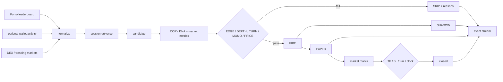

# Architecture

COPY is CLI-first. The interactive terminal, raw hunt feed and paper loop all use the same `CopyRuntime`; the browser wrapper is optional and sits beside it rather than owning the product.

The CLI is a single Node process with local JSON state. No database is required for `terminal`, `hunt`, `paper`, `scan`, `trader`, `positions`, `rules`, or `doctor`.

```text
bin/copy.mjs
    │
    ├── terminal ─┐
    ├── hunt ─────┼── CopyRuntime ── providers ── normalized data
    ├── paper ────┤       │
    ├── scan ─────┤       ├── candidates + rules
    ├── trader ───┤       ├── endless event stream
    └── doctor ───┘       ├── SHADOW mirrors
                           └── PAPER positions + marks
```

## Source tree

```text
bin/
└── copy.mjs                 command dispatch

src/cli/
├── runtime.mjs              bootstrap, provider merge, events, replay, mirrors, paper state
├── terminal.mjs             TTY lifecycle, keyboard input, timers
├── render.mjs               full-screen two-pane layout
├── hunt.mjs                 raw scrolling stream
├── paper.mjs                automatic paper loop
├── commands.mjs             doctor, scan, trader, positions, rules
├── rules.mjs                flow walls + exposure / budget decision
├── store.mjs                data/runtime.json persistence
├── format.mjs               numbers, links, PnL formatting
├── ansi.mjs                 terminal colors / control sequences
└── logo.mjs                 COPY wordmark + pixel COPYBARA

src/providers/
├── fomo.mjs                 public leaderboard + optional richer wallet/trending reads
├── dexscreener.mjs          token market enrichment
└── robinhood.mjs            server-side RH launch / trade reader

src/services/
├── scoring.mjs              wallet + token context scores
├── state.mjs                optional web/server aggregate state
├── copy-engine.mjs          web copy-rule evaluation
├── native-executor.mjs      optional server-side executor webhook boundary
└── cache.mjs                web/server cache

public/                       optional website wrapper
server.mjs                   optional HTTP / SSE server
data/seed.json               checked-in last-known-good bootstrap
data/runtime.json            CLI local state, created at runtime
contracts/CopyRegistry.sol   optional non-custodial rule registry
```

## Data flow of one candidate



## Bootstrap first, merge second

`CopyRuntime.init()` loads `data/seed.json` before any network request. That gives the terminal a last-known-good hunter / token universe instead of an empty first screen.

A live sync then **merges**:

- leaderboard rows by handle / id / name;
- markets by token address;
- wallet trades by trade id.

A shorter or degraded provider response therefore does not shrink the whole screen. The in-memory market universe grows for the session.

## Provider cycle

A normal CLI sync attempts:

1. Fomo leaderboard;
2. optional Fomo wallet trades;
3. optional Fomo trending markets;
4. DEX enrichment for every known / newly discovered address;
5. Robinhood Chain `eth_chainId` health check.

After the reads settle, runtime rebuilds candidates, records external changes, refreshes shadow mirrors, emits `SYNC`, and leaves the UI renderer to decide what is visible.

The CLI runtime currently uses Robinhood RPC as a chain-health check; the richer contract-log `RobinhoodProvider` is used by the optional server-side product path.

## Event stream

Events are append-only from the terminal's point of view and newest-first in memory.

```text
BOOT
READY / SCAN
NEW
BUY / SELL
MOVE
COPY
PNL
EXIT
SYNC
REPLAY NEW / REPLAY IN / REPLAY PNL / REPLAY MOVE
```

`stats.totalEvents` is monotonic. The in-memory event array is compacted at 20,000 rows so a long session does not grow memory forever.

## Scanner pulse

Provider data and scanner motion are intentionally separate.

`heartbeat()` selects the next candidate and re-runs the current decision state into a `SCAN` event. This means a quiet market still shows that the engine is alive without fabricating a wallet trade.

## COPY WALLETS

`refreshShadowCopies()` builds analytical mirrors from passing candidate + trader pairs and re-marks them from current prices. Showcase mode adds a larger replay mirror pool, changes pair assignments and moves prices on a faster timer.

The renderer only displays the current window; the pool can be larger than the number of terminal rows available.

## Replay mode

Replay is implemented inside `CopyRuntime`, not in the renderer. That matters because `terminal --demo` and any other caller see the same replay state.

The replay loop:

- seeds extra replay markets;
- periodically adds a brand-new replay market;
- moves a rotating set of prices / volumes;
- reassigns wallet/token mirror pairs;
- inserts new replay mirrors;
- re-runs normal scoring / wall logic;
- writes explicit `REPLAY` event types.

It never mutates a replay event into a live type.

## Local persistence

`src/cli/store.mjs` writes one JSON file, by default:

```text
data/runtime.json
```

It contains:

```text
rules
tracked sources
open paper positions
closed paper positions
paper session spend
event field reserved for local state
```

The location can be overridden with `COPY_RUNTIME_FILE`.

## Optional web / server path

`copy web` starts `server.mjs`, which owns a separate aggregate `State` and the browser wrapper. It can poll the fuller `RobinhoodProvider`, expose SSE/API state, persist its cache, and maintain copy-rule / native-queue records.

The native executor boundary is intentionally external:

```text
COPY server queue
      ↓
NATIVE_EXECUTOR_WEBHOOK
      ↓
your executor / relayer
      ↓
optional tx hash returned to COPY
```

If the webhook is empty, the server remains queue-only. Browser wallet connection is not used.

## Why the terminal is not the executor

Keeping the TUI and signer boundary separate gives three useful invariants:

1. opening the terminal cannot silently gain custody;
2. replay / paper code cannot accidentally become a live broadcast path;
3. a future executor can be audited and deployed independently from the presentation layer.

That boundary is deliberate. Read [`SAFETY.md`](SAFETY.md) before connecting an executor.
